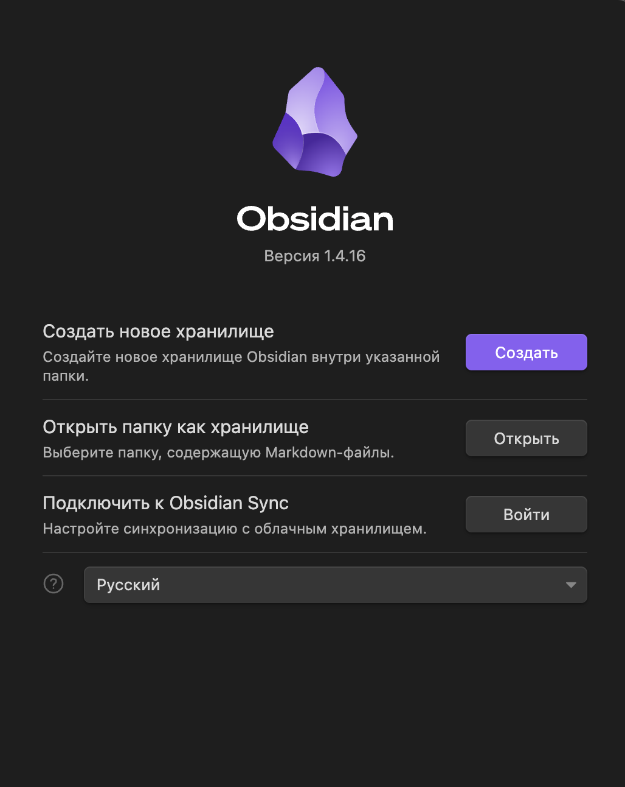

Как запустить базу знаний в obsidian.

1. Скачать программу на сайте https://obsidian.md/
2. При первом запуске вас встретит похожее окно  
3. Предварительно нужно склонировать репозиторий `erosrolf/knowledge_base/tree/main`
4. Выбрать локальный репозиторий в `Открыть папку как хранилище`.